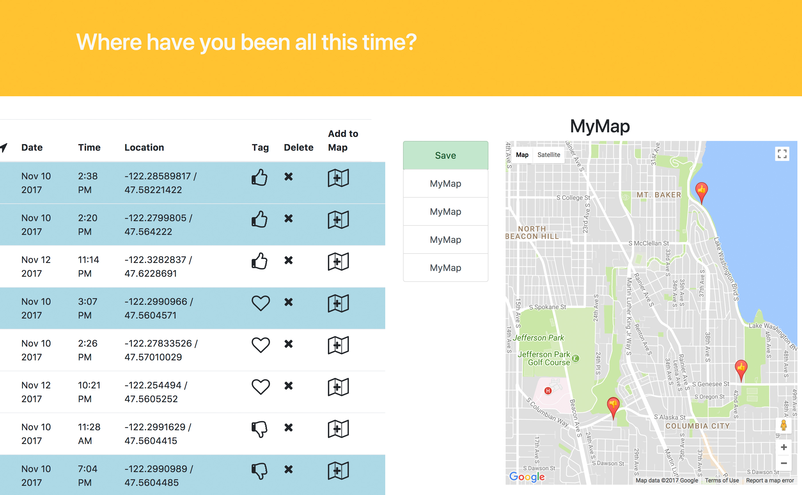

# Tracker-front-end
>Tracking app using Google Maps API. Logs user input from the smart button Flic on a map display.

This interface displays data gathered from a wearable clicker button through an Android app and a Google Sheet IFTTT recipe.
It was inspired by user research I did while working on a fitness tracker. 

Users can:

* view all their past logs in a list view
* add and remove their logs from the map view
* save maps in the database
* remove logs from the database

> [Demo here](http://putapinonit.surge.sh/)
(beware: first time loading is slow)

## Next Steps 

* Connect the server to Google Sheets to import real-time user data
* Display data in chronological order and allow users to filter it
* Enable adding descriptions and photos to logs and editing them
* Finish design (make it responsive)
